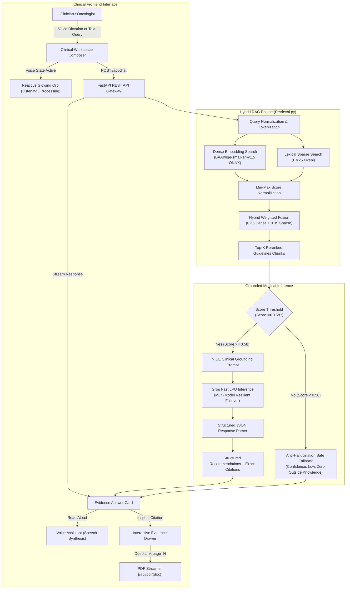

# 🩺 BreastCancer.ai — Clinical RAG Decision-Support Platform

<div align="center">

[](https://www.python.org/)
[](https://fastapi.tiangolo.com/)
[](https://groq.com/)
[](https://github.com/qdrant/fastembed)
[](https://github.com/dorianbrown/rank_bm25)
[](https://www.docker.com/)
[](LICENSE)

<br />

**An evidence-grounded clinical AI decision-support platform designed for breast oncology, strictly adhering to National Institute for Health and Care Excellence (NICE) guidelines.**

<br />

[✨ Key Innovations](#-key-innovations) • [🏗️ System Architecture](#️-system-architecture) • [🎙️ Voice & Interactive Ball](#️-voice-assistant--interactive-glowing-orb) • [🚀 Quickstart](#-quickstart-guide) • [📡 API Reference](#-api-reference) • [☁️ Free Cloud Deployment](#️-cloud-deployment--100-free-hosting) • [🧪 Verification Suite](#-automated-verification-suite)

</div>

---

## 📖 Executive Summary

**BreastCancer.ai** is an end-to-end, production-ready clinical AI decision-support platform built for oncologists, multidisciplinary cancer teams (MDTs), and medical researchers. It bridges the ultra-fast reasoning of **Groq LPUs** with strict, deterministic medical grounding from official **NICE Clinical Guidelines**:

* 📘 **NICE NG101**: Early and locally advanced breast cancer: diagnosis and management
* 📙 **NICE CG81**: Advanced breast cancer: diagnosis and treatment
* 📗 **NICE CG164**: Familial breast cancer: classification, care and managing risk

### 🎯 The Clinical Problem It Solves
Generic Large Language Models frequently generate medical hallucinations, cite outdated drug regimens, or cannot provide precise document-level accountability. **BreastCancer.ai** enforces a **zero-unsupported-assertions** policy using hybrid vector-lexical retrieval, dynamic threshold gating, page-level PDF preview synchronization, and two-way voice dictation.

---

## ✨ Key Innovations

| Capability | Description |
| :--- | :--- |
| **🔍 Hybrid Dual-Stage Retrieval** | Combines **Dense Vector Search** (`BAAI/bge-small-en-v1.5` ONNX) with **Sparse Lexical Search** (Rank-BM25 Okapi) using min-max weighted fusion (`0.65 Dense + 0.35 Sparse`). |
| **🛡️ Anti-Hallucination Guardrails** | Strict similarity thresholding ($S_{min} \ge 0.58$) rejects out-of-domain queries automatically with transparent low-confidence disclaimers. |
| **⚡ Ultra-Low Memory Engine** | Replaced heavy PyTorch runtimes (~550 MB RAM) with **FastEmbed ONNX Runtime** (<50 MB RAM), enabling flawless deployment on free 512 MB cloud tiers. |
| **📑 Verifiable Evidence Drawer** | Synchronized side-drawer displays exact guideline excerpt, section code, page bounds, and provides one-click deep links directly into the original PDF. |
| **🎙️ Real-Time Voice Dictation** | Hands-free clinical query input powered by the Web Speech API with smart silence detection and automatic query dispatch. |
| **🔊 Text-to-Speech Voice Assistant** | Reads out clinical summaries and evidence recommendations with animated soundwave feedback and click-to-stop controls. |
| **🔮 Interactive Reactive Orb** | Central UI orb dynamically responds to voice states: idle breathing, pulsing pink listening waves, and emerald processing vortex swirls. |
| **⚡ Groq Multi-Model Failover Chain** | Instant sub-second inference with resilient failover across multiple model tiers (`gpt-oss-120b`, `gpt-oss-20b`, `compound-mini`, `qwen-27b`, `allam-7b`). |

---

## 🏗️ System Architecture



---

## 🎙️ Voice Assistant & Interactive Glowing Orb

BreastCancer.ai includes a state-of-the-art multimodal clinical interface designed for sterile or busy clinical environments where hands-free interaction is essential:

```
                  ┌──────────────────────────────────────────────┐
                  │          🔮 Interactive Glowing Orb           │
                  │   • Idle: Soft ambient breathing rings       │
                  │   • Listening: Vibrant pink pulsing waves    │
                  │   • Processing: High-speed emerald vortex    │
                  └──────────────────────┬───────────────────────┘
                                         │
                 ┌───────────────────────┴───────────────────────┐
                 ▼                                               ▼
    🎙️ Hands-Free Voice Input                      🔊 Clinical Voice Output
    • Click Mic OR Click Orb to Speak             • Automatic speech synthesis
    • Real-time speech-to-text transcription      • Clear, natural medical pronunciation
    • Smart 1.6s silence auto-submission          • Interactive 🔊 Listen / ⏹ Stop badge
```

---

## 📁 Repository Structure

```
BreastCancer-Clinical-RAG/
├── server.py                   # FastAPI application server & REST endpoints
├── run.py                      # One-click launcher (port management & auto-browser)
├── clean_port.py               # Port-conflict management & clean shutdown utility
├── run.bat                     # Windows one-click batch launcher
├── verify_full_cycle.py        # Automated end-to-end verification test suite
├── requirements.txt            # Python production dependencies (FastEmbed, FastAPI, Groq)
├── Dockerfile                  # Multi-stage production container configuration
├── docker-compose.yml          # Container orchestration configuration
├── render.yaml                 # 1-Click Render Cloud deployment blueprint
├── Procfile                    # PaaS process configuration
├── .env.example                # Template for environment configuration
├── .gitignore                  # Git exclusion rules (strictly ignores secrets)
│
├── .github/
│   └── workflows/
│       └── verify.yml          # GitHub Actions Continuous Integration workflow
│
├── RAG system/                 # Core RAG engine & knowledge base
│   ├── Retrieval.py            # Hybrid retrieval, ONNX vector encoding & scoring
│   ├── Chunking_Metadata.py    # Guideline parser & page-aware chunking pipeline
│   ├── Parsing_Cleaning.py     # PDF text extraction & structure normalization
│   ├── Embedding.py            # BGE vector generation script
│   ├── requirements.txt        # RAG-specific requirements
│   └── Data/
│       ├── NG101.pdf           # NICE Early & Locally Advanced Breast Cancer (550 KB)
│       ├── CG81.pdf            # NICE Advanced Breast Cancer Guideline (198 KB)
│       ├── CG164.pdf           # NICE Familial Breast Cancer Guideline (255 KB)
│       ├── chunks_metadata.json# Pre-computed chunk metadata with section & page bounds
│       └── chunk_vectors.npy   # Pre-computed 384-dimensional BGE embedding vectors
│
└── breast-cancer-ai-clean/     # Frontend Web Interface
    ├── index.html              # Animated splash entry screen
    ├── home.html               # Clinical landing page & interactive orb
    ├── chat.html               # Clinical workspace & Evidence Drawer
    ├── uploaded-pdfs.html      # Guideline library catalog & inline PDF viewer
    ├── citation-history.html   # Evidence citation history log & markdown export
    ├── assets/
    │   └── logo.svg            # Vector UI branding icon
    ├── css/
    │   ├── base.css            # Design tokens, typography & pulsating mic animations
    │   ├── splash.css          # Splash screen animations
    │   ├── home.css            # Landing layout & interactive orb voice animations
    │   ├── chat.css            # Chat interface, soundwave bars & evidence drawer
    │   └── library.css         # Document grid & preview modal
    └── js/
        ├── splash.js           # Splash loader logic
        ├── home.js             # Orb voice interaction & query submission
        ├── chat.js             # RAG integration, Speech-to-Text & Speech Synthesis
        ├── library.js          # Document viewer & PDF modal controller
        └── history.js          # Citation storage, search & clipboard copy
```

---

## 🚀 Quickstart Guide

### Prerequisites
- **Python 3.11+** installed ([Download Python](https://www.python.org/downloads/))
- A free **Groq Cloud API Key** ([Get free key here](https://console.groq.com/keys))

### 1. Clone the Repository
```bash
git clone https://github.com/belalhazem511/BreastCancer-Clinical-RAG.git
cd BreastCancer-Clinical-RAG
```

### 2. Create and Activate Virtual Environment
```bash
# Create virtual environment
python -m venv .venv

# Activate virtual environment
# On Windows (PowerShell):
.venv\Scripts\Activate.ps1
# On Linux / macOS:
source .venv/bin/activate
```

### 3. Install Dependencies
```bash
pip install -r requirements.txt
```

### 4. Configure Environment Variables
Create a `.env` file in the project root:
```bash
cp .env.example .env
```
Add your Groq API key:
```env
GROQ_API_KEY=gsk_your_actual_groq_api_key_here
PORT=8000
```

### 5. Launch the Application

#### Option A: One-Click Python Launcher (Recommended)
```bash
python run.py
```
> *Automatically verifies port availability, starts the FastAPI server, and launches your default browser at `http://127.0.0.1:8000`.*

#### Option B: Windows Batch Launcher
Double click `run.bat` or run in terminal:
```cmd
run.bat
```

#### Option C: Direct Uvicorn Command
```bash
uvicorn server:app --host 0.0.0.0 --port 8000 --reload
```

#### Option D: Docker Container
```bash
docker-compose up --build
```

---

## 📡 API Reference

### 1. `POST /api/chat`
Execute a clinical query grounded against NICE guidelines.

**Request Payload:**
```json
{
  "question": "What is the recommended endocrine therapy for hormone receptor positive early breast cancer?"
}
```

**Response (`200 OK`):**
```json
{
  "success": true,
  "has_context": true,
  "confidence": "High",
  "source_match": "83%",
  "summary": "Offer adjuvant endocrine therapy to all people with ER-positive invasive early breast cancer...",
  "recommendations": [
    "Offer tamoxifen as initial adjuvant endocrine therapy to premenopausal women.",
    "Offer an aromatase inhibitor (anastrozole or letrozole) to postmenopausal women at high risk of recurrence."
  ],
  "supporting_evidence": [
    "Adjuvant endocrine therapy significantly reduces 10-year breast cancer mortality in ER-positive disease."
  ],
  "citations": [
    {
      "source": "NICE NG101",
      "section": "Section 1.11",
      "pages": "Pages 32–33",
      "guideline_title": "Early and locally advanced breast cancer",
      "text": "1.11.1 Offer adjuvant endocrine therapy to people with ER-positive invasive early breast cancer...",
      "hybrid_score": 0.826,
      "pdf_url": "/api/pdf/NG101.pdf#page=32"
    }
  ]
}
```

---

### 2. `GET /api/sources`
Retrieve metadata and status for all connected clinical guidelines.

**Response (`200 OK`):**
```json
{
  "total_guidelines": 3,
  "sources": [
    {
      "code": "NG101",
      "title": "Early and locally advanced breast cancer: diagnosis and management",
      "type": "NICE Guideline",
      "status": "Connected & Indexed",
      "pages": 67,
      "size": "550 KB",
      "filename": "NG101.pdf"
    },
    {
      "code": "CG81",
      "title": "Advanced breast cancer: diagnosis and treatment",
      "type": "NICE Clinical Guideline",
      "status": "Connected & Indexed",
      "pages": 44,
      "size": "198 KB",
      "filename": "CG81.pdf"
    },
    {
      "code": "CG164",
      "title": "Familial breast cancer: classification, care and managing risk",
      "type": "NICE Clinical Guideline",
      "status": "Connected & Indexed",
      "pages": 52,
      "size": "255 KB",
      "filename": "CG164.pdf"
    }
  ]
}
```

---

### 3. `GET /api/pdf/{filename}`
Streams the guideline PDF with inline viewing headers.
- **Example**: `GET /api/pdf/NG101.pdf`
- **Jump directly to page**: `/api/pdf/NG101.pdf#page=32`

---

### 4. `GET /api/health`
System health check endpoint.
```json
{
  "status": "healthy",
  "engine": "FastEmbed ONNX + BM25",
  "memory_footprint": "<50MB",
  "groq_connected": true,
  "indexed_chunks": 426
}
```

---

## 🧪 Automated Verification Suite

The repository includes a comprehensive verification test suite validating all REST routes, static assets, PDF serving, hybrid RAG scoring, and out-of-context rejection:

```bash
python verify_full_cycle.py
```

### Test Suite Execution Output:
```
============================================================
  RUNNING FULL-CYCLE VERIFICATION TEST SUITE
============================================================
[OK] Static HTML Page /                         -> 200 OK
[OK] Static HTML Page /home.html                -> 200 OK
[OK] Static HTML Page /chat.html                -> 200 OK
[OK] Static HTML Page /uploaded-pdfs.html       -> 200 OK
[OK] Static HTML Page /citation-history.html    -> 200 OK
[OK] Static Asset     /js/chat.js               -> 200 OK
[OK] Static Asset     /css/chat.css             -> 200 OK
[OK] API /api/health            -> 200 OK (Status: healthy)
[OK] API /api/sources           -> 200 OK (3 connected guidelines: NG101, CG81, CG164)
[OK] PDF Serving /api/pdf/NG101.pdf    -> 200 OK (550,639 bytes)
[OK] PDF Serving /api/pdf/CG81.pdf     -> 200 OK (198,127 bytes)
[OK] PDF Serving /api/pdf/CG164.pdf    -> 200 OK (255,533 bytes)

[*] Testing Clinical Query (NG101): 'What is the recommended endocrine therapy for ER+ early breast cancer?'
[OK] Clinical Query RAG Response -> 200 OK (Confidence: High, Citations: 4 chunks)

[*] Testing Clinical Query (CG164): 'What surveillance is recommended for BRCA mutation carriers?'
[OK] Familial Breast Cancer RAG Response -> 200 OK (Confidence: High, Citations: 4 chunks)

[*] Testing Out-of-Context Query (Threshold Rejection): 'What is the capital of Australia?'
[OK] Out-of-Context Rejection   -> 200 OK (Confidence: Low, 0 hallucinations)

============================================================
  ALL FULL-CYCLE VERIFICATION TESTS PASSED SUCCESSFULLY!  
============================================================
```

---

## ☁️ Cloud Deployment — 100% Free Hosting

### 1. Hugging Face Spaces (100% Free CPU Docker)
1. Go to [Hugging Face Spaces](https://huggingface.co/new-space).
2. Space Name: `breastcancer-rag`
3. Space SDK: **Docker** (Blank)
4. Visibility: **Public**
5. Go to **Settings** → **Variables and secrets** → **New secret**:
   - `GROQ_API_KEY`: `your_groq_api_key`
6. Push code to your Space:
   ```bash
   git remote add space https://huggingface.co/spaces/<your-username>/breastcancer-rag
   git push space main
   ```
7. Hugging Face builds your container and serves it on port `7860`.

---

### 2. Render (100% Free Web Service)
1. Go to [Render Dashboard](https://dashboard.render.com/) and click **New +** → **Web Service**.
2. Connect your GitHub repository: `belalhazem511/BreastCancer-Clinical-RAG`.
3. Configure Build Settings:
   - **Environment**: `Python`
   - **Build Command**: `pip install -r requirements.txt`
   - **Start Command**: `uvicorn server:app --host 0.0.0.0 --port $PORT`
4. Add Environment Variable:
   - `GROQ_API_KEY`: `your_groq_api_key`
5. Click **Deploy Web Service**.

---

## ⚖️ Clinical Safety Disclaimer

> [!IMPORTANT]
> **BreastCancer.ai** is a clinical decision-support and research assistant designed to assist qualified healthcare professionals by indexing, retrieving, and citing published **NICE Clinical Guidelines**. It does not constitute medical advice, provide autonomous clinical diagnoses, or replace professional oncology judgment. Clinicians should corroborate all generated recommendations against the primary NICE guideline publications directly accessible within the application.

---

## 📄 License

This project is open-source software licensed under the **[MIT License](LICENSE)**.

<div align="center">
  <sub>Built with clinical rigor for the Oncology AI Community.</sub>
</div>
